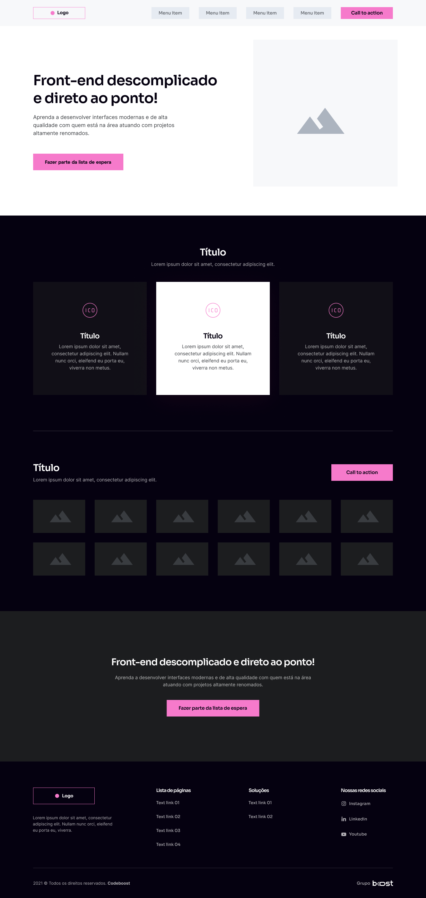

<h1 align="center">
    <br>Wireframe<br/>
     HTML5 | CSS3
</h1>
<h2>
</h2>
<p align="center">
  <a href="#bookmark-sobre">Sobre</a>&nbsp;&nbsp;&nbsp;|&nbsp;&nbsp;&nbsp;
  <a href="#rocket-tecnologias">Tecnologias</a>&nbsp;&nbsp;&nbsp;|&nbsp;&nbsp;&nbsp;
  <a href="#boom-como-executar">Como Executar</a>&nbsp;&nbsp;&nbsp;|&nbsp;&nbsp;&nbsp;
  <a href="#memo-licença">Licença</a>
</p>
<p align="center">
  <a href="#">
    
  </a>
</p>
<p align="center">
<br>
  
<p>

## :bookmark: Sobre

O **Wireframe** é uma aplicação Web e Mobile feita para auxiliar no treinamento de criação de projetos. Logo, esta aplicação oferece aos alunos a visão de como um website e criado do absoluto zero, através do HTML5 semântico e CSS3 responsivo tornando o site acessível a qualquer dispositos móveis.
  
Este projeto foi idealizado pensando na estrutura de um site moderno.
  
Essa aplicação foi realizada durante as aulas do Curso **CodeBoost**, projeto do [William Moreira](https://github.com/WillMoreiraDev).

## :rocket: Tecnologias

-  [HTML5](https://developer.mozilla.org/pt-BR/docs/Web/HTML)
-  [CSS3](https://developer.mozilla.org/pt-BR/docs/Web/CSS)

## :boom: Como Executar

- ### **Pré-requisitos**

  - É **necessário** possuir o **[Git](https://git-scm.com/)** instalado e configurado no computador

1. Faça um clone do repositório:

```sh
  $ git clone https://github.com/LuisRobertoAntunes/Wireframe.git
```

## :memo: Licença

Esse projeto está sob a licença MIT. Veja o arquivo [LICENSE](LICENSE.md) para mais detalhes.

---
<sup>Projeto desenvolvido com a tutoria de [William Moreira](https://github.com/WillMoreiraDev), da [CodeBoost](https://codeboost.com.br/).</sup>
